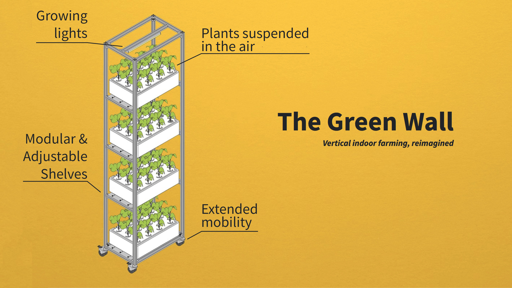

# reimagine.farm - The Green Wall 

Green Wall is a modular approach to soilless vertical farming. It takes advantage of fogponics (usage of fog in farming) and the Internet of Things to increase efficiency & crop yield while limiting waste output to solve traditional resource-intensive farming.

## Inspiration
Food security is an imperative global issue. Under threat by an increasingly unpredictable climate, growing populations, rising prices, and inadequate transportation infrastructure, we have yet to figure out how to keep everyone fed. Inspired and challenged by the ideals of the Solar Decathlon Middle East competition, the Green Wall aims to make food more local and personal by introducing food production into the built environment, complementing the urban desire for efficiency and individuality. Our motivation is to challenge the notion that all food production must occur as a detached and remote process to consumers living in cities.

## How it works?
The system takes advantage of fogponics and the Internet of Things to increase growth efficiency and crop yield while decreasing energy usage and waste output. It's capable of continuously & autonomously monitoring the plants’ growth cycles for delivering nutrients precisely and providing an optimal amount of light to save energy. The modular design of the vertical farming units allow the system to be used both on an individual basis or scaled up to a commercial level. The system can grow 1.5 kg of produce in a week using 2 liters of water, about 50 times more water efficient than conventional farming. Fog is used as the medium for delivering nutrients and water to plants. The system is flexible so that different plant combinations can be easily grown by adjusting the distance between the growing boxes. They can be stacked to increase growth capacity and each column communicates with each other for sharing and optimizing the resources available.

## How it is different?
Other vertical farming solutions are designed as inflexible megastructures, whether they come in the form of fixed racks of plants or remodelled shipping containers. On the contrary, the Green Wall allows vertical farming to occur at home or industrial campus, emphasizing the ability to resize and reshape, as well as allowing for the option to share data across communities local or international. Moreover, the Green Wall was developed to be equipped with replaceable and widely known components, eliminating any reliance on proprietary hardware or software. This allows for the system to be rebuilt with a completely different set of suppliers without any compromise in functionalities, championing adaptability. In short, the Green Wall is clean farming made modular and decentralized.

